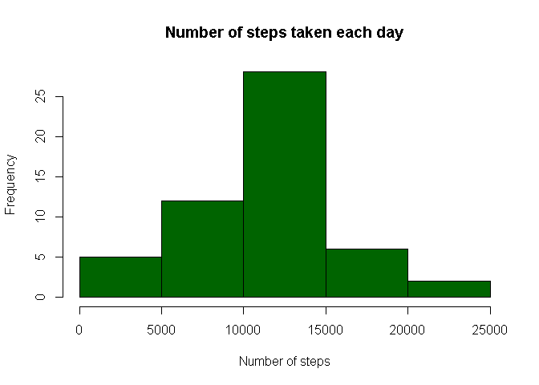
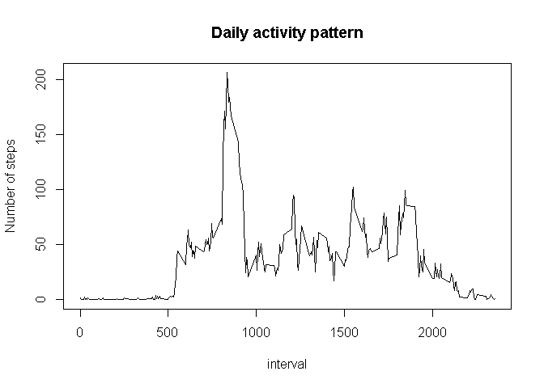
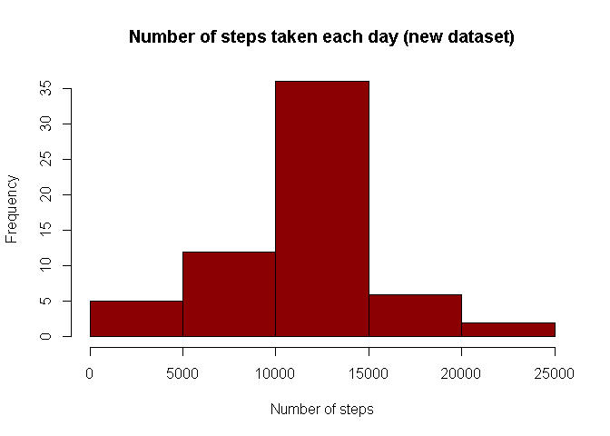
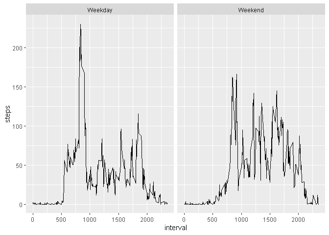

```r
library(lubridate)
library(dplyr)
library(ggplot2)
Sys.setlocale(locale = 'English')
```

```
## [1] "LC_COLLATE=English_United States.1252;LC_CTYPE=English_United States.1252;LC_MONETARY=English_United States.1252;LC_NUMERIC=C;LC_TIME=English_United States.1252"
```
## Loading and preprocessing the data

```r
data <- read.table(unz("activity.zip", "activity.csv"), header=T, sep=",")

data$date <- ymd(data$date)
```
## What is mean total number of steps taken per day?

### Calculate the total number of steps taken per day

```r
daily <- group_by(data, date) %>%
  summarise(steps=sum(steps))
```
### Make a histogram of the total number of steps taken each day

```r
hist(daily$steps, main = 'Number of steps taken each day'
     , xlab = 'Number of steps'
     , col = 'darkgreen')
```

<!-- -->

### Calculate and report the mean and median total number of steps taken per day

```r
stepsMean <- mean(daily$steps, na.rm=TRUE)
stepsMedian <- median(daily$steps, na.rm=TRUE)
```
Mean number of steps taken per day is 1.0766189\times 10^{4}

Median number of steps taken per day is 10765

## What is the average daily activity pattern?

### Make a time series plot (i.e. type = "l") of the 5-minute interval (x-axis) and the average number of steps taken, averaged across all days (y-axis)


```r
dailyIntervals <- group_by(data, interval) %>%
  summarise(steps=mean(steps, na.rm=TRUE))

plot(dailyIntervals$interval, dailyIntervals$steps, type = 'l'
     ,xlab = 'interval'
     ,ylab = 'Number of steps'
     ,main = 'Daily activity pattern'
     )
```

<!-- -->

### Which 5-minute interval, on average across all the days in the dataset, contains the maximum number of steps?

```r
maxInterval <- dailyIntervals[which.max(dailyIntervals$steps),1]
```
The interval with maximum number of steps taken on average across all the days is 835

## Imputing missing values

### Calculate and report the total number of missing values in the dataset

```r
completeRows <- sum(!complete.cases(data))
```
Number of missing values in the dataset is 2304

### Devise a strategy for filling in all of the missing values in the dataset. The strategy does not need to be sophisticated. For example, you could use the mean/median for that day, or the mean for that 5-minute interval, etc.
### Using Mean for the intervals to compute missing values

```r
dataNew <- merge(data, dailyIntervals, by='interval')
dataNew$steps.x[is.na(dataNew$steps.x)] <- round(dataNew$steps.y[is.na(dataNew$steps.x)])
```

### Create a new dataset that is equal to the original dataset but with the missing data filled in.

```r
dataNew <- arrange(dataNew, date)
dataNew <- select(dataNew, steps.x, date, interval)
colnames(dataNew)[1] <- "steps"
```

### Make a histogram of the total number of steps taken each day and Calculate and report the mean and median total number of steps taken per day. Do these values differ from the estimates from the first part of the assignment? What is the impact of imputing missing data on the estimates of the total daily number of steps?

```r
dailyNew <- group_by(dataNew, date) %>%
  summarise(steps=sum(steps))
hist(dailyNew$steps, main = 'Number of steps taken each day (new dataset)'
     , xlab = 'Number of steps'
     , col = 'darkred')
```

<!-- -->

```r
stepsMeanNew <- round(mean(dailyNew$steps, na.rm=TRUE),2)
stepsMedianNew <- median(dailyNew$steps, na.rm=TRUE)
```
New Mean number of steps taken per day is 1.076564\times 10^{4} (previous value was 1.0766189\times 10^{4})

New Median number of steps taken per day is 1.0762\times 10^{4} (previous value was 10765)

Imputing missing data has increased the estimates of the total daily number of steps.

## Are there differences in activity patterns between weekdays and weekends?

### Create a new factor variable in the dataset with two levels -- "weekday" and "weekend" indicating whether a given date is a weekday or weekend day.


```r
dataNew$wd <- weekdays(dataNew$date, abbreviate = TRUE)
weekdays <- c('Mon','Tue', 'Wed','Thu','Fri')
dataNew$wd <- ifelse(is.element(dataNew$wd,weekdays), 'Weekday','Weekend')
dataNew$wd <- as.factor(dataNew$wd)
```

### Make a panel plot containing a time series plot (i.e. \color{red}{\verb|type = "l"|}type = "l") of the 5-minute interval (x-axis) and the average number of steps taken, averaged across all weekday days or weekend days (y-axis). See the README file in the GitHub repository to see an example of what this plot should look like using simulated data.


```r
dailyIntervalsNew <- group_by(dataNew, interval, wd) %>%
  summarise(steps=mean(steps, na.rm=TRUE))
qplot(interval, steps, data = dailyIntervalsNew, facets = .~wd, geom = "path")
```

<!-- -->
